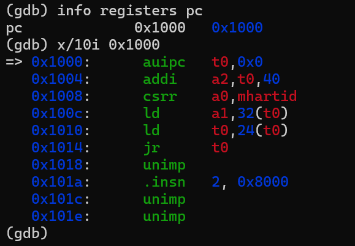
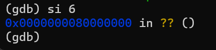
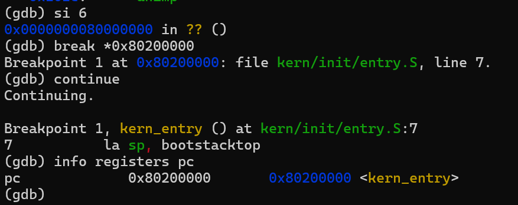

# Lab 1 练习 2：使用 GDB 跟踪 RISC-V 启动流程

## 1. 实验目的

本练习使用 QEMU 模拟 RISC-V 计算机，并通过 GDB 跟踪系统从 CPU 复位到操作系统内核入口的启动过程。

通过观察程序计数器（PC）的变化和关键汇编指令，分析 RISC-V 系统从复位代码进入 OpenSBI，再由 OpenSBI 将控制权交给 ucore 内核的过程。

重点验证以下三个地址：

- `0x1000`：QEMU virt 机器的复位入口。
- `0x80000000`：OpenSBI 固件入口。
- `0x80200000`：ucore 内核入口 `kern_entry`。

## 2. 实验环境与调试方法

本实验在 Windows WSL2 的 Ubuntu 环境中完成，使用 RISC-V 交叉编译工具链编译内核，并通过 QEMU 和 GDB 进行调试。

首先进入项目的 `code` 目录，执行：

```bash
make
make debug
```

其中，`make` 用于生成内核文件 `bin/kernel` 和镜像 `bin/ucore.img`，`make debug` 用于启动 QEMU，并通过 `-s -S` 参数开启 GDB 调试端口、暂停 CPU 执行。

随后打开第二个终端，执行：

```bash
gdb-multiarch bin/kernel
```

在 GDB 中依次输入：

```gdb
set architecture riscv:rv64
target remote localhost:1234
```

GDB 成功连接 QEMU 后，即可观察 CPU 寄存器和执行指令。

## 3. RISC-V 启动流程分析

### 3.1 CPU 复位入口：0x1000

连接 GDB 后，执行：

```gdb
info registers pc
x/10i 0x1000
```

得到 PC 寄存器的值：

```text
pc    0x1000    0x1000
```

并观察到以下关键汇编指令：

```asm
0x1000: auipc t0,0x0
0x1004: addi  a2,t0,40
0x1008: csrr  a0,mhartid
0x100c: ld    a1,32(t0)
0x1010: ld    t0,24(t0)
0x1014: jr    t0
```

其中：

- `auipc t0,0x0`：将当前 PC 地址作为基址保存到 `t0`。
- `addi a2,t0,40`：计算并传递启动参数地址。
- `csrr a0,mhartid`：读取当前硬件线程（hart）的编号。
- `ld a1,32(t0)`：读取设备树地址。
- `ld t0,24(t0)`：读取下一阶段的入口地址。
- `jr t0`：跳转到该入口地址。

由此可知，复位代码负责准备必要的启动信息，并将控制权转交给下一阶段固件。



### 3.2 OpenSBI 固件入口：0x80000000

在 GDB 中执行：

```gdb
si 6
```

即单步执行复位入口处的六条汇编指令。

GDB 显示：

```text
0x0000000080000000 in ?? ()
```

这说明程序在执行 `jr t0` 后，PC 到达 `0x80000000`。

该地址对应本实验 QEMU 环境中的 OpenSBI 固件入口，验证了系统从复位代码向 OpenSBI 的控制权转移。

OpenSBI 在启动过程中负责底层平台初始化，并为后续运行的操作系统内核提供 SBI（Supervisor Binary Interface）服务。



### 3.3 ucore 内核入口：0x80200000

为了验证 OpenSBI 能否正确进入 ucore 内核，在 GDB 中设置断点：

```gdb
break *0x80200000
continue
```

运行结果如下：

```text
Breakpoint 1 at 0x80200000: file kern/init/entry.S, line 7.
Continuing.

Breakpoint 1, kern_entry () at kern/init/entry.S:7
7           la sp, bootstacktop
```

继续执行：

```gdb
info registers pc
```

得到：

```text
pc    0x80200000    0x80200000 <kern_entry>
```

由此确认，OpenSBI 已成功将控制权移交给位于 `0x80200000` 的 ucore 内核入口 `kern_entry`。

此时即将执行的 `la sp, bootstacktop` 指令用于设置内核栈指针，为后续内核初始化提供栈空间。



## 4. 实验结果

通过 QEMU 和 GDB 调试，成功观察并验证了 RISC-V 系统的三个关键启动阶段：

| 启动阶段 | PC 地址 | 验证方法 | 实验结果 |
|---|---|---|---|
| CPU 复位代码 | `0x1000` | `info registers pc`、`x/10i` | 成功 |
| OpenSBI 固件入口 | `0x80000000` | `si 6` | 成功 |
| ucore 内核入口 | `0x80200000` | `break`、`continue`、`info registers pc` | 成功 |

整体启动路径为：

```text
CPU 复位入口
    0x1000
       |
       v
OpenSBI 固件入口
  0x80000000
       |
       v
ucore 内核入口
  0x80200000
```

## 5. 实验总结

本练习通过 GDB 单步执行、断点调试和 PC 寄存器观察，验证了 QEMU RISC-V 虚拟机从 CPU 复位入口到操作系统内核入口的启动过程。

实验表明，CPU 首先执行 `0x1000` 处的复位代码，通过间接跳转进入 `0x80000000` 处的 OpenSBI 固件；随后 OpenSBI 完成必要的启动处理，将控制权交给位于 `0x80200000` 的 ucore 内核入口。

通过本次调试，进一步理解了 RISC-V 系统中复位代码、OpenSBI 和操作系统内核之间的启动关系，以及利用 GDB 跟踪底层启动流程的方法。

