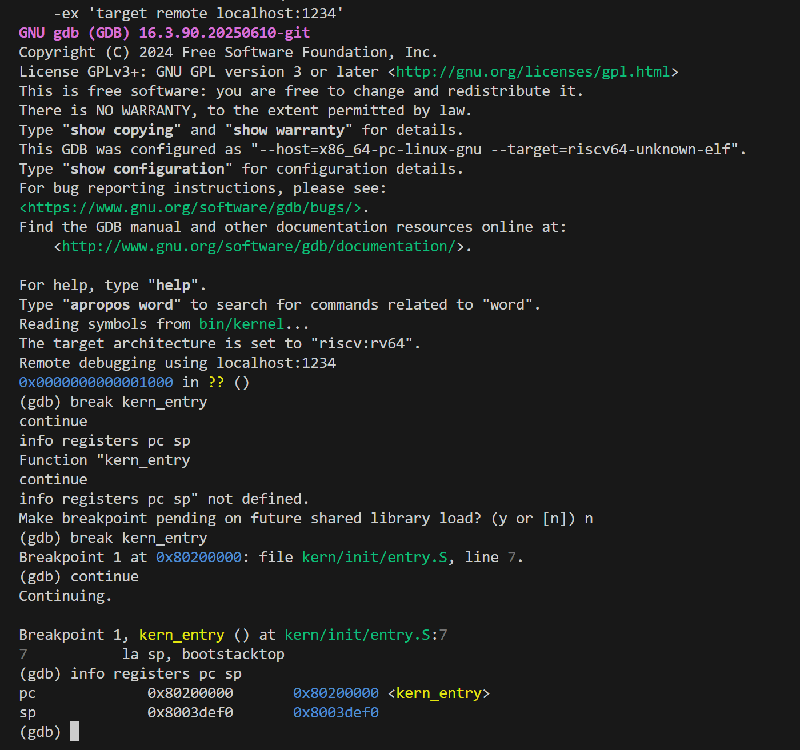
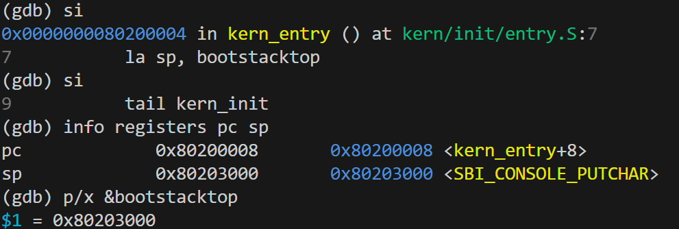
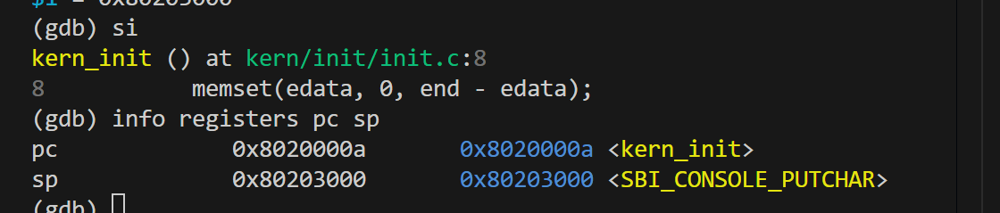
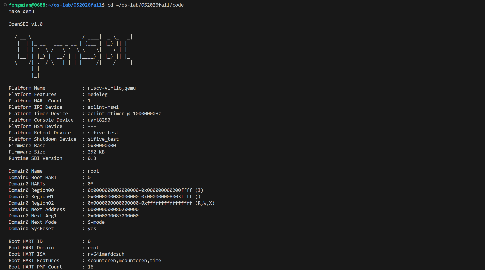
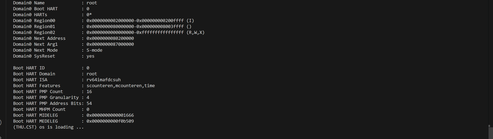

# 练习1 独立草稿：理解内核启动中的程序入口操作

> **本文件性质**：练习1 的独立草稿，仅供本人负责的「练习1」使用，**不是**正式报告。
> 正式报告 `report/report.md` 的「四、实验内容与实现 → 练习」小节可从本文件整理。
> 本文件**只保留技术内容**（题目分析、代码解释、实验过程、调试验证、截图、技术总结）。
> AI Prompt、提示词迭代、AI 协作过程与人工纠错记录已分离到 `report/prompt-member1.md`。
> 本文件**不包含**其他组员的练习内容；未修改 `report/report.md` 与 `report/prompt.md`。

---

## 一、练习1 正式解答

### 练习1：理解内核启动中的程序入口操作

**负责人：** [学号-姓名]

**题目：** 阅读 `kern/init/entry.S` 内容代码，结合操作系统内核启动流程，说明指令 `la sp, bootstacktop` 完成了什么操作，目的是什么？`tail kern_init` 完成了什么操作，目的是什么？

#### 1.1 相关源码与宏定义

`code/kern/init/entry.S`：

```asm
    .section .text,"ax",%progbits
    .globl kern_entry
kern_entry:                      # entry.S:6
    la sp, bootstacktop          # entry.S:7
    tail kern_init               # entry.S:9
.section .data
    .align PGSHIFT               # entry.S:13
    .global bootstack
bootstack:                       # entry.S:15
    .space KSTACKSIZE            # entry.S:16
    .global bootstacktop
bootstacktop:                    # entry.S:18
```

相关宏：

- `code/kern/mm/mmu.h:4-5`：`PGSIZE = 4096`、`PGSHIFT = 12`；
- `code/kern/mm/memlayout.h:4-5`：`KSTACKPAGE = 2`、`KSTACKSIZE = KSTACKPAGE * PGSIZE = 8192` 字节（8 KiB）。

#### 1.2 `la sp, bootstacktop` 的操作与目的

**操作：** `la`（load address，伪指令）把标签 `bootstacktop` 的**地址**装入栈指针寄存器 `sp`，即 `sp = &bootstacktop`，指向内核栈的**高地址端（栈顶）**。

**目的：**

1. 紧接着的第 9 行要跳入 C 语言函数 `kern_init()`；C 函数运行需要栈来保存返回地址、局部变量与被保存的寄存器，因此进入 C 之前必须先让 `sp` 指向一块合法的栈。
2. RISC-V 的栈**从高地址向低地址增长**，把 `sp` 设在栈顶即表示栈当前为空；压栈时向低地址生长，栈的使用区间为 `[bootstack, bootstacktop)`。
3. 该栈 8 KiB、页对齐，满足 RISC-V 过程调用约定（psABI）对栈 16 字节对齐的要求。

> 注意：**「分配」内核栈不是 `la` 做的。** 栈空间由 `.space KSTACKSIZE`（`entry.S:16`）在汇编/链接阶段静态预留；`la sp, bootstacktop` 只是把 `sp` 指向这块已预留空间的栈顶。

#### 1.3 `tail kern_init` 的操作与目的

**操作：** `tail` 是无条件跳转伪指令，把控制流转移到 `kern_init` 的入口；其语义等价于 `jal x0, kern_init`——**目标寄存器是 `x0`（零寄存器），即不保存返回地址**。

**目的：**

1. 把控制权从汇编交给 C 内核入口 `kern_init()`（`code/kern/init/init.c:6`）。
2. 之所以用 `tail` 而非 `call`：`call` 会把返回地址写入 `ra`(x1) 寄存器，`tail` 写入 `x0`（丢弃）。此处不需要返回地址——`kern_init` 被声明为 `noreturn`（`init.c:4`），函数体末行为 `while (1);`（`init.c:12-13`），运行期不会返回。

> 需与常见误解区分：`call` 与 `tail` 指令本身**都不向栈写返回地址**；返回地址寄存器是 `ra`，与栈无关。是否把 `ra` 落栈由被调函数自己的序言决定（`kern_init` 因内部调用 `memset`/`cprintf`，序言中有 `sd ra,8(sp)`）。

#### 1.4 内核栈的大小、地址与对齐

| 项 | 值 | 来源 |
|---|---|---|
| 大小 | `KSTACKSIZE = 2 × 4096 = 8192` 字节 = **8 KiB** | `memlayout.h:4-5`、`mmu.h:4` |
| 起始（`bootstack`） | `0x80201000`（页对齐） | `nm bin/kernel` |
| 结束（`bootstacktop`） | `0x80203000`（页对齐，16 字节对齐） | `nm bin/kernel` |
| 差值 | `0x80203000 − 0x80201000 = 0x2000 = 8192` | 实测 |

对齐：`readelf -A bin/kernel` 显示 `Tag_RISCV_stack_align: 16-bytes`，即本目标要求栈 16 字节对齐；`bootstacktop = 0x80203000` 是 16（乃至 4096）字节的整数倍，**当前源码满足要求**。

#### 1.5 反汇编与符号验证

```console
$ riscv64-unknown-elf-readelf -h bin/kernel | grep Entry
  Entry point address:               0x80200000

$ riscv64-unknown-elf-nm bin/kernel | grep -iE "kern_entry|kern_init|bootstack"
0000000080200000 T kern_entry
000000008020000a T kern_init
0000000080201000 D bootstack
0000000080203000 D bootstacktop

$ riscv64-unknown-elf-objdump -d -M no-aliases --disassemble=kern_entry bin/kernel
0000000080200000 <kern_entry>:
    80200000: 00003117   auipc sp,0x3
    80200004: 00010113   addi  sp,sp,0
    80200008: a009       c.j   8020000a <kern_init>
```

| 源码伪指令 | 最终机器指令 | 寄存器变化 | 控制流变化 |
|---|---|---|---|
| `la sp, bootstacktop` | `auipc sp,0x3` + `addi sp,sp,0` | `sp ← PC(0x80200000) + 0x3000 = 0x80203000`；不写 `ra` | 顺序执行 |
| `tail kern_init` | `c.j 8020000a` | 不写 `ra` | `pc ← 0x8020000a`（`kern_init`），不返回 |

说明：

- `auipc` 取 `PC + 0x3000 = 0x80203000`，正是 `bootstacktop`；后一条 `addi` 的立即数为 0，因为位移 `0x3000` 的低 12 位恰为 0。
- 反汇编默认显示会把这些写成别名 `mv sp,sp`、`j`；用 `-M no-aliases` 可见真实的 `addi sp,sp,0` 与 `c.j`。
- 对照未链接目标文件 `obj/kern/init/entry.o`：`la` → `auipc sp + addi sp,sp`，`tail` → `auipc t1 + jalr zero`（8 字节）；链接时在压缩指令扩展与链接器松弛（`R_RISCV_RELAX`）作用下变为 2 字节 `c.j`。
- 概念区分：`la`/`tail` 是**汇编伪指令**（会展开为机器指令）；`.section`/`.globl`/`.space`/`.align` 是**汇编指示符**（不产生机器指令，只影响节属性/符号绑定/大小/对齐）；`auipc`/`addi`/`jalr`/`c.j` 是**最终机器指令**。

#### 1.6 GDB 实测验证

在 `make debug` 启动的 QEMU（`-s -S`，GDB 通过 `target remote localhost:1234` 连接）上单步执行，对 1.2、1.3 的结论做动态验证。

**（1）命中内核入口**

`break kern_entry` 后在 `entry.S:7` 停下，`pc = 0x80200000`；此时 `sp = 0x8003def0`，仍是固件留下的栈——因为 `la sp, bootstacktop` 尚未执行。



**（2）`la sp, bootstacktop` 使 `sp` 指向栈顶**

执行完该指令后 `sp = 0x80203000`，与 `p/x &bootstacktop` 的结果一致，即 §1.2 所述 `sp = &bootstacktop`。



**（3）`tail kern_init` 跳转到 `0x8020000a`**

再单步即进入 `kern_init()`（`init.c:8`），`pc = 0x8020000a`，与 §1.5 `nm` 输出的 `kern_init` 符号地址一致；`sp` 保持 `0x80203000` 不变，说明跳转本身不改动栈。



> 三张图中 `0x80203000` 均被 GDB 标注为 `<SBI_CONSOLE_PUTCHAR>`，原因是 `bootstacktop` 是 `.data` 末端的**零长度标签**，与 `.sdata` 首部的 `SBI_CONSOLE_PUTCHAR` 同址（该同址问题的发现与纠正记录见 `report/prompt-member1.md`）。

#### 1.7 小结

`la sp, bootstacktop` 把栈指针指向内核栈顶，为进入 C 代码建立起可用的运行栈；`tail kern_init` 以不保存返回地址的方式把控制权交给 C 内核入口 `kern_init`（该函数运行期不返回）。栈空间由 `.space KSTACKSIZE` 静态预留 8 KiB，并满足 16 字节对齐。

---

## 二、实验过程与验证步骤

1. 阅读 `entry.S`、`init.c`、`kernel.ld`，核对行号与宏定义（`PGSIZE`/`PGSHIFT`/`KSTACKPAGE`/`KSTACKSIZE`）。
2. `make` 构建，产出 `bin/kernel`（ELF）与 `bin/ucore.img`。
3. `readelf -h` 取入口地址；`nm` 取 `kern_entry`/`kern_init`/`bootstack`/`bootstacktop` 的实际地址与差值。
4. `objdump -d` 与 `objdump -d -M no-aliases` 对照 `kern_entry` 的最终机器码；再反汇编未链接的 `entry.o` 与 `readelf -r` 重定位，解释「汇编定型、链接填数/松弛」。
5. `readelf -A` 确认栈 16 字节对齐属性。
6. 运行 QEMU：先用项目命令（`make qemu`，当时仍为 `-device loader` 加载方式），再用 `-kernel` 对照，并用 GDB 断点定位控制流去向。这一步的**对照实验**后来成为定位启动问题的关键（见 §三）。
7. 结束后 `make clean`，保持仓库干净。

---

## 三、启动问题的发现、定位与修复

> 本节记录一个已定位并已修复的问题。修复前的现象属于历史记录，当前仓库状态下 `make qemu` 与 `make debug` 均可正常进入内核。

### 3.1 修复前现象

| 启动方式 | 现象 |
|---|---|
| `make qemu`（当时 `qemu` 目标为 `-device loader,file=$(UCOREIMG),addr=0x80200000`） | OpenSBI 正常打印横幅，但内核**无任何输出**，不见 `(THU.CST) os is loading ...` |
| `make debug`（同上参数，额外带 `-s -S`） | GDB 在 `0x80200000` 下的断点**未命中**，控制流停在 `0x0` |

两条现象指向同一结论：固件把控制权交给了 `0x0`，内核入口 `kern_entry` 从未被执行。（均由串口输出与 GDB 断点实测得到。）

### 3.2 原因分析（基于实测对照）

问题定位在**启动参数**上：原来的 `-device loader,file=$(UCOREIMG),addr=0x80200000` 只是把镜像字节放到指定物理地址，**未能正确提供下一阶段入口**，固件因而没有把控制权交给 `0x80200000`——这与 3.1 中「GDB 停在 `0x0`」的现象一致。

改用 `-kernel $(UCOREIMG)` 后，OpenSBI 报告的 Next Address 变为 `0x80200000`，内核随即正常运行。

据以定位的依据是**对照实验**：同一份内核镜像、同一工具链，仅改变 QEMU 的加载选项，行为即从「不进内核」变为「正常进入内核」。因此问题出在启动参数，与内核代码、链接产物无关。（本节只陈述实测到的对照结果，不展开固件内部的参数传递细节。）

### 3.3 Makefile 修改

将 `qemu` 与 `debug` 两个目标的启动参数由 `-device loader` 改为 `-kernel`：

```diff
 qemu: $(UCOREIMG) $(SWAPIMG) $(SFSIMG)
 	$(V)$(QEMU) \
 		-machine virt \
 		-nographic \
 		-bios default \
-		-device loader,file=$(UCOREIMG),addr=0x80200000
+		-kernel $(UCOREIMG)
```

`debug` 目标做同样修改（保留 `-s -S`）。改用 `-kernel` 后，OpenSBI 报告的 Next Address 与内核链接地址 `0x80200000` 一致（见 3.4）。

### 3.4 修复后验证

**`make qemu`**：OpenSBI 横幅中 `Domain0 Next Address : 0x80200000`，与内核链接地址一致；随后内核打印 `(THU.CST) os is loading ...`，说明控制权已正确交给 `kern_entry` → `kern_init`。





> **正式报告整合提示**：这两张 QEMU 截图正是最终报告「五、测试与验证」所需的 `make qemu` 运行证据，可在该部分直接使用。整合时请**每张图只引用一次**——若第五部分已引用，本节改为文字描述即可，避免同一截图重复出现。

**`make debug` + GDB**：断点成功命中 `kern_entry`（`0x80200000`），单步后 `sp = 0x80203000`（即 `bootstacktop`），再单步跳转到 `kern_init`（`pc = 0x8020000a`）。三个断点截图见 §1.6。

至此，启动问题闭环：**定位（现象）→ 分析（启动参数未提供正确入口）→ 修复（改用 `-kernel`）→ 验证（QEMU 输出 + GDB 单步）**。练习1 的结论（`la`、`tail` 的语义）不依赖具体启动参数，但该修复使得这些结论可以在真实运行中被直接观测。

---

## 四、知识收获素材（供最终报告「六、实验总结与收获」使用）

- **内核启动链路**：复位（QEMU 为 `0x1000`）→ OpenSBI 固件（`0x80000000`，M 态）→ 内核（`0x80200000`），对应 OS 原理中「固件 → bootloader → 操作系统」的分层交接。
- **链接脚本与内存布局**：`tools/kernel.ld` 用 `BASE_ADDRESS`、`ENTRY`、段排布（`.text`/`.rodata`/`.data`/`.sdata`/`.bss`）描述内核镜像布局，是「加载到内存的程序」的静态蓝图。
- **交叉编译与链接**：在 x86 上生成 riscv64 目标代码；伪指令在汇编阶段定型、重定位/松弛在链接阶段完成。
- **栈与过程调用约定（ABI）**：栈指针 `sp`、返回地址 `ra`、零寄存器 `x0`、临时寄存器 `t1` 的分工；栈向下增长、16 字节对齐。
- **汇编层次**：伪指令（`la`/`tail`）→ 真实指令（`auipc`/`addi`/`jalr`/`c.j`）；`mv`/`j` 等只是反汇编别名。
- **特权级与 SBI**：内核运行于 S 态，通过 `ecall` 调用 M 态 OpenSBI 服务（如控制台输出）。

---

*本文件为草稿，待人工审核后再决定是否并入正式报告。AI 协作记录见 `report/prompt-member1.md`。*
